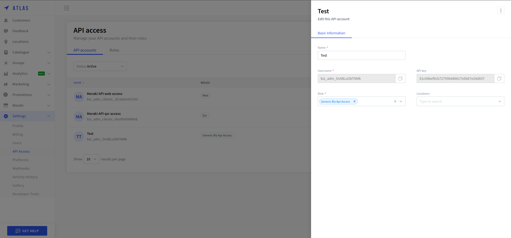

==========
UrbanPiper
==========

Integrating UrbanPiper allows you to seamlessly connect multiple delivery platforms, streamlining order management and improving operational efficiency. UrbanPiper is essential for businesses that manage multiple delivery platforms as it simplifies the entire process. Instead of handling separate systems for each delivery provider, UrbanPiper allows you to manage all orders from a single interface.

Configuration
=============

.. _urban_piper/credentials:

Find Your UrbanPiper Credentials
--------------------------------

`Go to your Atlas account <https://atlas-pos-int.urbanpiper.com>`_ and retrieve your API key and username.

You will need the following credentials to set up the Point of Sale in Odoo:

- API key
- Username

Configure Your Point of Sale
----------------------------

#. :doc:`Activate the Point of Sale - UrbanPiper module <../../../../general/apps_modules>` to enable UrbanPiper.

#. Go to :ref:`POS'settings <configuration/settings>` and find the Food Delivery Connector.

    #. Fill in the :guilabel:`API key and Username` fields with your :ref:`Credentials <urban_piper/credentials>`.

    .. image:: urban_piper/food_delivery_connector.png
        :alt: Food Delivery Connector

Create Your Location on Atlas
-----------------------------

#. `Go to the Locations <https://atlas-pos-int.urbanpiper.com/locations>`_ tab.

    .. image:: urban_piper/atlast_location.png
        :alt: Locations menu

#. Click on :guilabel:`Add a new location` and enter the required details:

    .. image:: urban_piper/add_location.png
        :alt: Add new location

#. Go to your location and paste your POS ID into the field below, which is generated on the Food Delivery Connector page in the Point of Sale configuration:

    .. image:: urban_piper/atlas_pos_id.png
        :alt: Atlas POS ID

Configure Products for Online Delivery
--------------------------------------

#. Go to the :guilabel:`Point of Sale` tab on the product form by navigating to :menuselection:`Point of Sale --> Products --> Products`, then click on any product.

#. Fill in the details under the :guilabel:`URBAN PIPER` section.

    .. image:: urban_piper/product_form.png
        :alt: Product form

Sync Menu
=========

#. Go to :ref:`POS'settings <configuration/settings>` and find the Food Delivery Connector.
#. Press the :guilabel:`Sync menu` button.

    .. note::
      After successfully syncing the menu, a success notification will appear. Below the :guilabel:`Sync menu` button, the :guilabel:`Last Sync on` timestamp will display. Note that the sync menu process can take 2-3 minutes to update the menu on the UrbanPiper Atlas platform.

    .. image:: urban_piper/sync_menu.png
        :alt: Sync menu

Order Flow
==========

#. When someone places an order at your shop/restaurant, you will be notified with sound and a notification. To view the order, simply click on "Review Order" and you will be redirected to the orders page.

    .. image:: urban_piper/order_notification.png
        :alt: Order notification

#. Additionally, there is a cart button in the navbar. Clicking this button will give you options for :guilabel:`New, Ongoing, and Done`.

    .. image:: urban_piper/cart_button.png
        :alt: Cart button

        .. note::
        The "New" button indicates placed orders, "Ongoing" is for acknowledged orders, and "Done" is for food-ready orders.

#. After clicking the :guilabel:`Accept` button, the order is acknowledged and moves to the preparation display.

    .. image:: urban_piper/order_accept.png
        :alt: Order accepted

    .. image:: urban_piper/kichen_display_order.png
        :alt: Kitchen display order

#. When the order is ready, simply click :guilabel:`Mark as ready`, and the order status changes to :guilabel:`Food Ready`, marking the order as paid.

#. In some cases, the shop/restaurant may want to cancel an order. In this case, click on :guilabel:`Reject`, and a pop-up will appear like below.

    .. image:: urban_piper/reject_order.png
        :alt: Reject order pop-up

        .. note::
        For Swiggy orders, they cannot be directly rejected. If you attempt to reject a Swiggy order, Swiggy customer support will contact the restaurant.
